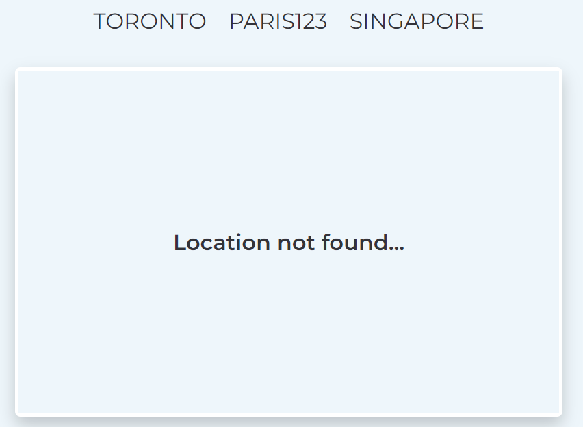

# ReactJS Weather App using LESS in styling

## Create an .env file and paste the code below

```
REACT_APP_GETCITY_API="https://api.openweathermap.org/geo/1.0/direct?q="
REACT_APP_GETWEATHER_API="https://api.openweathermap.org/data/2.5/onecall?"
REACT_APP_CROSS_DOMAIN="https://the-ultimate-api-challenge.herokuapp.com"
REACT_APP_API_KEY=be56721f2765afd4e946bf6cc853af53
```

## Screenshots


